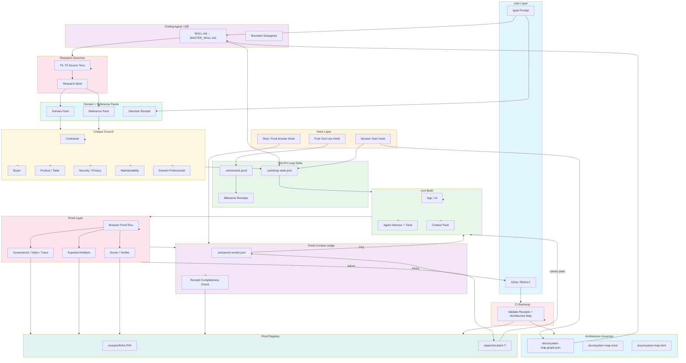
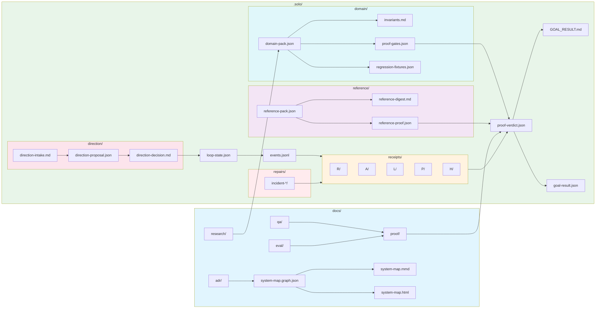

# Solo Founder Agent Builder

### One prompt in. A researched, built, browser-verified agent product out.

Solo Founder Agent Builder turns your preferred coding agent into a proof-driven product engineer.

It does not stop when code merely compiles.

It researches what good means, builds the app and its agent, runs the real workflow through the application UI, captures evidence, repairs failures, and only claims completion when the proof verdict passes.

> **Skills suggest. Hooks observe. State remembers. Receipts prove.**

<div align="center">


<sub>↑ A one-prompt run: the agent researches, builds a 3D product story, separates builder and customer routes, and proves it with gates.</sub>
</div>

## Why this exists

Most agent repos give an AI model a skill, plugin, MCP server, or rule file and call it autonomous.

That is not enough.

A coding agent can still:

- agree with a weak idea;
- skip domain research;
- produce an ugly UI;
- say tests passed when the browser is visually broken;
- generate a package-shaped output that is professionally useless;
- forget context after a long session;
- overwrite user-owned data;
- claim completion without a real proof run.

Solo Founder Agent Builder adds the missing operating system around the model:

- durable goal state;
- self-researched domain packs;
- reference-driven product quality;
- executable acceptance gates;
- browser proof;
- visual and domain judges;
- hooks;
- receipts;
- anti-shallow QA;
- recovery and repair loops.

The goal is simple:

> Give a coding agent one product goal and make it leave behind proof, not vibes.

---

## /goal Cup quickstart

Use this for one-prompt hackathons, autonomous coding sessions, and agent benchmarks.

1. Open the repository you want the coding agent to modify.
2. Start your preferred coding agent.
3. Paste one `/goal` prompt.
4. Do not provide more steering.
5. Judge the final output by the proof it returns.

### Copy this prompt

Replace `<YOUR GOAL>` with the thing you want built.

```text
/goal

Fetch and follow the Solo Founder Agent Builder from:

https://github.com/HomenShum/solo-founder-agent-builder

Use:
skills/solo-founder-nodes/SKILL.md
then:
skills/solo-founder-nodes/MASTER_SKILL.md

Work inside THIS repository.

GOAL:
<YOUR GOAL>

This is a one-prompt autonomous run. I will not provide additional guidance after submitting this message.

Do not wait for clarification. Make the safest reversible assumptions, record them, and continue.

AUTONOMY ENVELOPE

You are authorized to:
- inspect and modify this repository;
- install ordinary local development dependencies;
- create local branches and isolated worktrees;
- run local servers, browsers, tests, benchmarks, and evaluators;
- use existing configured credentials without displaying them;
- choose free/local providers or existing approved providers;
- research current official documentation, examples, benchmarks, papers, and relevant product references;
- spawn bounded subagents for research, implementation, verification, security, product critique, visual review, and repair;
- retry and repair failed work autonomously;
- commit completed local work.

You are not authorized to:
- delete user data or unrelated files;
- publish publicly or merge to production without an existing explicit policy;
- incur new paid spend beyond the configured budget;
- purchase services;
- expose secrets;
- weaken security, privacy, held-out, or proof requirements;
- hardcode benchmark answers.

REQUIRED PROCESS

1. Initialize the durable RALPH loop and inspect the current repository state.
2. Identify the target user, workflow, artifact, application surface, and agent task.
3. Research the domain and generate a source-backed domain pack.
4. If the goal references an existing product, tutorial, style, workflow, or inspiration, generate a Reference RALPH pack before implementation.
5. Run a contrarian product, buyer, engineering, security, maintainability, and taste review before committing to the plan.
6. Compile the domain and reference packs into acceptance criteria and executable proof gates.
7. Build both:
   - the application agent/harness/tools/context;
   - the user-facing UI needed to run and inspect the workflow.
8. Keep the work resumable through durable state, events, receipts, and checkpoints.
9. Run the workflow through the real application UI using a fresh browser state.
10. Capture screenshots, video, traces, exported artifacts, scorer results, runtime, cost, model usage, and known limitations.
11. When a test, visual check, benchmark, or tool fails:
    - record the evidence;
    - determine root cause;
    - spawn an isolated repair lane when useful;
    - add a regression fixture;
    - verify the repair in a fresh context;
    - allow future work lanes to use the repaired version only after a canary passes.
12. Do not stop because the transcript sounds plausible.
13. Before the final response, run the fresh-context completion judge.
14. Only return PASS when the durable proof verdict passes.

ANTI-SHALLOW QA POLICY

Do not claim QA passed from unit tests, DOM inspection, or successful commands alone.

For every changed user-facing feature:
1. Reproduce the original failure or create a negative fixture.
2. Run the real user path in a browser.
3. Capture screenshot or video.
4. Check console errors.
5. Verify pixels, not only DOM.
6. Verify the domain invariant.
7. Verify reload/reopen/export when applicable.
8. Save receipts.
9. Run a fresh-context judge over the receipts.
10. Report PASS only if the proof depth matches the feature type.

If a test passes but the screenshot looks wrong, treat the test as shallow and fix the test.
If the DOM looks right but the visible pixels are wrong, treat the product as failing.
If the output exists but cannot be reopened or professionally used, treat the workflow as failing.

If blocked by a true external requirement such as an unavailable secret, paid account, destructive approval, or inaccessible system, finish all deterministic work first, record the exact blocker and resume command, and return BLOCKED rather than pretending success.

FINAL RESPONSE

Return one concise GOAL RESULT containing:
- verdict: PASS, PARTIAL, or BLOCKED;
- the original goal;
- what was built;
- how to run it;
- live URL or local command;
- browser proof;
- tests and benchmark result;
- exported artifact paths;
- screenshot, video, trace, and receipt paths;
- model, cost, runtime, and tool-call summary;
- git commit;
- known limitations;
- exact next action only when blocked.
```

---

## What counts as done?

A coding agent saying "done" does not count.

A task is complete only when the repository contains evidence that:

1. The requested workflow runs through the real application UI.
2. The application's agent actually performs the task.
3. Required artifacts are produced and can be reopened.
4. Tests, domain checks, and benchmark/scorer gates pass.
5. Screenshots, video, traces, metrics, and receipts exist.
6. The fresh-context judge returns `done`.
7. `.solo/proof-verdict.json` passes.

### The doctrine

```text
No receipt, no number.
No live UI proof, no product claim.
No self-researched domain pack, no build.
No domain proof, no domain claim.
No reference pack, no product-quality claim.
No before/after visual receipt, no UX fix.
No negative fixture, no regression claim.
```

---

## What the agent creates

A successful run may create:

```text
.solo/
  loop-state.json
  events.jsonl
  proof-verdict.json
  GOAL_RESULT.md
  goal-result.json

  receipts/
    R/
    A/
    L/
    P/
    H/

  direction/
    direction-intake.md
    direction-proposal.json
    direction-decision.md

  domain/
    domain-pack.json
    invariants.md
    proof-gates.json
    regression-fixtures.json

  reference/
    reference-pack.json
    reference-digest.md
    reference-proof.json

  repairs/
    incident-*/
      incident-brief.json
      root-cause.md
      patch-contract.md
      verification.json
      promotion-receipt.json

docs/
  qa/
  proof/
  eval/
  research/
  adr/
  system-map.graph.json
  system-map.mmd
  system-map.html
```

The exact files depend on the target repo and goal.

---

## How the loop works

Solo Founder Agent Builder is built around RALPH:

```text
R — Reality
    Understand the user, product, workflow, repo, constraints, domain, and current state.

A — Acceptance Bar
    Define what good means using proof gates, benchmarks, visual checks, and domain invariants.

L — Live Build
    Build the app, the agent, the UI, the tools, and the workflow surface.

P — Proof Run
    Run through the real application UI. Capture screenshots, video, trace, exports, scorer, and receipts.

H — Harden
    Convert failures into regression gates, memory, repair receipts, and future-proof constraints.
```

That gives the macro loop.

Then specialized loops run when needed.

---

## Anchored RALPH

> **No anchor artifact, no next phase.**

Each RALPH phase must produce a concrete anchor artifact before the next phase can begin. Without anchors, the agent drifts into sycophantic approval, invented architecture, god objects, bad directory layouts, and shallow proof.

### Phase anchors

```text
R — Reality
  Anchor: .solo/anchors/R-system-context.json
  Required: repo inventory, system map read receipt, affected nodes, directory map, patterns to reuse, anti-god-object risk list
  Block if: no architecture graph read, no affected nodes, no pattern inspection

A — Acceptance
  Anchor: .solo/anchors/A-proof-contract.json
  Required: domain pack, reference pack if applicable, proof gates, negative fixtures, directory contract, rejected options
  Block if: no proof gates, no rejected options, no directory contract, no research brief when required

L — Live Build
  Anchor: .solo/anchors/L-implementation-map.json
  Required: implementation slices, file placement plan, no god-object check, component ownership boundaries, architecture delta
  Block if: runtime/tool/agent/db/ui code not in graph, file exceeds threshold, unowned shared blob

P — Proof
  Anchor: .solo/anchors/P-proof-ledger.json
  Required: browser proof for UI, export/reopen for artifacts, domain proof, visual proof, telemetry
  Block if: unit-only proof for UI, DOM-only proof for visual state, no negative regression

H — Harden
  Anchor: .solo/anchors/H-hardening-ledger.json
  Required: root-cause patch contract, rework ledger, changed system map, ADR if architecture changed, resume command
  Block if: failure fixed with no regression, architecture changed with no ADR/graph update
```

### Architecture graph as phase gate

The canonical `docs/system-map.graph.json` is not a pretty diagram. It is the phase gate.

```text
R phase: must read graph
A phase: must identify affected nodes
L phase: must update graph if architecture changes
P phase: must prove graph-linked runtime path
H phase: must record architecture delta or rejected update
```

### Directory shape governor

Force code organization before edits. Block god objects. Use `src/nodeagent/`-style structure for agent apps:

```text
src/
  nodeagent/
    core/        — orchestrator, state, events, hooks, queue, receipts
    models/      — router, providers, prompts
    tools/       — registry, filesystem, browser, search, domain
    domains/     — domain packs, invariants, proof gates, fixtures
    guardrails/  — approval, circuit breaker, anti-shallow QA, sanitize
    mcp/         — tools, resources, prompts
  features/
    <feature>/
      components/
      hooks/
      types.ts
      proof.ts
  ui/
  shared/
```

Anti-god-object limits:

```json
{
  "maxFileLines": 350,
  "maxComponentLines": 250,
  "maxFunctionLines": 80,
  "noGodObjects": true
}
```

If the agent creates a 1,400-line `App.tsx`, the judge returns `not_done`.

### Preceptor review

Before Live Build and before final pass, run a preceptor council:

```text
Preceptor Council
  ├── Staff engineer — boundaries, file ownership, maintainability
  ├── Product engineer — user workflow, UI clarity, product taste
  ├── Domain expert — professional acceptability
  ├── Security/privacy reviewer — data boundaries, secrets, unsafe actions
  ├── QA/eval reviewer — proof gates, negative fixtures, anti-shallow QA
  └── Contrarian — sycophancy, overclaiming, unnecessary complexity
```

Output: `.solo/reviews/preceptor-review.md` + `.solo/reviews/preceptor-review.json`

### Hook enforcement

```text
Hook event        Required behavior
────────────────────────────────────────────────────────────────────────────
SessionStart      Read docs/system-map.graph.json; store graph hash.
UserPromptSubmit  Classify: architecture? research? UI? eval? domain?
PreToolUse        If editing architecture-sensitive paths without R/A anchors, block.
PostToolUse       If changed files touch agents/tools/db/ui/hooks, mark graph update required.
SubagentStart     Inject affected graph nodes, directory contract, invariants.
Stop              Block if anchors, graph update, research brief, tests, or proof are missing.
CI/pre-commit     Repeat the graph/research/directory/proof checks outside the agent.
```

CI is required because hooks can guide supported agent lifecycles, but they are not the hard correctness boundary. Repo-level guards must backstop them.

### Anchor checklist

```text
R — Reality
  [ ] Read architecture graph
  [ ] Write architecture_read receipt
  [ ] Inspect existing directory patterns
  [ ] Identify affected nodes/edges/files
  [ ] Identify anti-pattern risks
  [ ] Write System Context Packet

A — Acceptance
  [ ] Create domain pack
  [ ] Create reference pack when applicable
  [ ] Create proof contract
  [ ] Create directory contract
  [ ] Create negative fixtures
  [ ] Run Preceptor Council
  [ ] Write accepted/rejected options

L — Live Build
  [ ] Implement within planned file map
  [ ] Avoid god objects
  [ ] Keep functions/modules bounded
  [ ] Update architecture graph if runtime changes
  [ ] Update ADR if architectural decision changes
  [ ] Emit implementation receipts

P — Proof
  [ ] Run deterministic tests
  [ ] Run live browser if UI changed
  [ ] Run export/reopen if artifacts changed
  [ ] Run visual/taste proof if product surface changed
  [ ] Run domain proof if professional workflow changed
  [ ] Run anti-shallow QA
  [ ] Write proof ledger

H — Harden
  [ ] Add regression fixture
  [ ] Write root-cause patch contract
  [ ] Update rework ledger
  [ ] Update system map / research brief / ADR
  [ ] Run fresh-context judge
  [ ] Emit GOAL_RESULT
```

### What this changes in practice

Before:

```text
Agent: "I'll add an agent runtime."
Writes: src/agent.ts, src/tools.ts, src/App.tsx, maybe tests.
Says done.
```

After:

```text
Agent: "I'll add an agent runtime."
Must first:
  read architecture graph
  produce System Impact Brief
  research if SDK/harness-sensitive
  decide tool vs subagent vs MCP vs hook
  write file placement plan
  pass preceptor review

Then:
  implement bounded modules
  update graph
  run tests/evals
  run proof
  block final if receipts missing
```

This is how you stop "AI-shaped architecture."

> **The model writes code. The harness forces architecture, research, proof, and maintainability.**

---

## End-to-end sequence

What happens behind the scenes from the moment a user pastes a `/goal` prompt into any coding agent or IDE:

```mermaid
sequenceDiagram
    autonumber
    actor User
    participant IDE as Coding Agent / IDE
    participant Skill as SKILL.md + MASTER_SKILL.md
    participant Hooks as Hook Layer
    participant Loop as RALPH Loop State
    participant Research as Research Governor
    participant Domain as Domain Pack
    participant Ref as Reference Pack
    participant Council as Critique Council
    participant Build as Live Build
    participant Browser as Browser Proof
    participant Judge as Fresh-Context Judge
    participant Registry as Proof Registry
    participant CI as CI Backstop

    User->>IDE: Paste /goal prompt
    Note over IDE: Session starts
    Hooks->>Loop: Read loop state (.solo/loop-state.json)
    Hooks->>IDE: Inject context: architecture graph, prior receipts
    IDE->>Skill: Fetch SKILL.md → MASTER_SKILL.md
    Skill->>Loop: Initialize durable RALPH state

    rect rgb(240, 248, 255)
        Note over IDE,Domain: R — Reality
        IDE->>IDE: Inspect repo, current state, system map
        IDE->>Research: Query: what domain + references apply?
        Research-->>IDE: Research brief (T0–T5 sources)
        IDE->>Domain: Generate domain pack (ontology, invariants, proof gates)
        IDE->>Ref: Generate reference pack (if product/style/SDK reference exists)
    end

    rect rgb(255, 250, 240)
        Note over Council,Loop: A — Acceptance Bar
        IDE->>Council: Run critique council
        Council->>Council: Contrarian / buyer / taste / security / maintainability / domain
        Council-->>IDE: Challenges, risks, accepted/parked/rejected
        IDE->>Loop: Compile acceptance criteria → executable proof gates
        Loop->>Registry: Register required receipts (screenshots, video, trace, scorer, domain)
    end

    rect rgb(240, 255, 240)
        Note over IDE,Build: L — Live Build
        IDE->>Build: Build app UI + agent harness + tools + context
        Hooks->>IDE: Post-tool-use: record events, check safety
        Build->>Loop: Checkpoint progress (events.jsonl, receipts/R/)
        IDE->>IDE: Keep work resumable (durable state, checkpoints)
    end

    rect rgb(255, 240, 245)
        Note over IDE,Registry: P — Proof Run
        IDE->>Browser: Run real workflow in fresh browser
        Browser->>Browser: Capture screenshots, video, trace, exports
        Browser->>Browser: Check console errors, verify pixels
        Browser->>Browser: Verify domain invariants, reload/reopen/export
        Browser-->>Registry: Save proof receipts

        alt Failure detected
            Browser->>Loop: Record failure evidence
            Loop->>IDE: Trigger Reflex RALPH
            IDE->>IDE: Classify root cause (transient / task-specific / systemic)
            IDE->>IDE: Spawn isolated repair lane
            IDE->>Browser: Add regression fixture, re-run same user path
            Browser->>Loop: Canary check before promoting fix
            Browser-->>Registry: Save repair receipts (repairs/incident-*/)
        end
    end

    rect rgb(248, 240, 255)
        Note over Judge,Registry: H — Harden + Final Judge
        IDE->>Judge: Run fresh-context completion judge
        Judge->>Registry: Verify all required receipts exist
        Judge->>Registry: Check proof-verdict.json
        alt Receipts missing or proof insufficient
            Judge-->>IDE: FAIL — return to Live Build or Proof Run
        else All proof gates pass
            Judge-->>IDE: PASS
        end
    end

    IDE->>Loop: Write GOAL_RESULT.md + goal-result.json
    IDE->>CI: Push commit (CI runs proof registry backstop)
    CI->>Registry: Validate receipts, architecture map, proof verdict
    IDE-->>User: Return GOAL RESULT (PASS / PARTIAL / BLOCKED)
    Note over User: Judge by proof receipts, not transcript
```

---

## System architecture graph

How the Solo Founder Agent Builder components connect:



## Component dependency graph

What a successful run creates and how the artifacts depend on each other:



---

## Direction RALPH

Used when the user changes product direction.

Examples:

```text
"Make it like Emergent + Spline."
"Turn this into an OpusClip-style video pipeline."
"Change this from a demo into a finance war room."
"Make our own OSS version instead of integrating a proprietary tool."
```

The agent must produce a direction receipt before coding.

```text
Old direction
New direction
Why it changed
Invalidated assumptions
New required proof gates
Accepted / parked / rejected inspiration
```

---

## Reference RALPH

Used when the goal references a product, tutorial, visual style, SDK workflow, design system, or external inspiration.

Examples:

```text
Emergent + Spline
Open Design
assistant-ui
React Bits
Claude Artifacts
OpusClip
Attio
Linear
Notion
Bruno Simon
Igloo Inc
```

The agent must extract:

```text
what to adopt
what to avoid
what not to copy
what implementation stack matters
what proof gates the reference implies
what product-quality bar must be met
```

Reference RALPH prevents the agent from building a technically working but ugly, irrelevant, or product-weak artifact.

---

## Domain RALPH

Used when the goal belongs to a professional domain.

Examples:

```text
finance-nodeagent
3d-assets
construction-mockups
video-remix
image-editing
agent-app
web-app-ui
data-pipeline
game-assets
avatar-vtuber
manufacturing-parts
```

A domain pack contains:

```text
domain classification
target users
jobs to be done
ontology
professional invariants
proof gates
negative fixtures
regression fixtures
child RALPH loops
```

Example:

```text
3D asset:
  components must exist
  assemblies must connect
  export must reopen
  canonical views must pass

Finance workflow:
  numbers must have evidence
  formulas must not be clobbered
  citations must open source regions
  private context must not leak
```

---

## Component, Assembly, and Operation RALPH

For compositional products, the agent must go deeper than "output exists."

### Component RALPH

Proves the parts exist and have roles.

```text
eyewear:
  frame
  lens
  hinge
  temple arm
  bridge
  nose pad
```

### Assembly RALPH

Proves the parts connect into a coherent object or workflow.

```text
lens contained by ring
bridge connects left and right frame
temple arm attaches to hinge
spreadsheet output cell links to source fact
video caption does not cover speaker face
```

### Operation RALPH

Proves the user action works.

```text
brush select
replace material
export
reopen
approve
reject
retry
upload
download
attach to chat
```

---

## Reflex RALPH

Used when a failure appears while a long run is still in progress.

Instead of waiting until the whole benchmark ends:

```text
failure event
  -> incident broker
  -> classify transient vs task-specific vs systemic
  -> spawn repair subagents
  -> verify fix in isolated generation
  -> promote fixed version to future lanes
```

The active run stays version-pinned so evidence does not get corrupted.

---

## Anti-shallow QA

A feature is shallowly tested if the agent only proves:

```text
the function ran
the DOM node exists
the command exited 0
the model said it worked
```

A feature is deeply tested when it proves:

```text
real user path
visible pixels
no console errors
artifact correctness
export/reopen
domain invariants
negative fixture
fresh-context judge
durable receipt
```

Minimum proof depth:

| Feature type              | Minimum proof                                             |
| ------------------------- | --------------------------------------------------------- |
| Utility function          | Unit test + negative fixture                              |
| Backend mutation          | Integration test + idempotency                            |
| UI component              | DOM + screenshot + console check                          |
| User workflow             | Browser video + trace + reload                            |
| File upload/preview       | Upload + open + reload + attach                           |
| Spreadsheet edit          | Cell state + version + CAS + export/reopen                |
| Human-agent collaboration | Multi-user browser + no-clobber + trace                   |
| Finance workflow          | Evidence + citation + privacy + export/reopen             |
| 3D asset                  | Component + assembly + visual + export/reopen             |
| Benchmark claim           | Fresh room + scorer + video + receipt + visual judge      |
| Notification/downstream   | Audience + privacy + idempotency + delivery/draft receipt |

---

## Architecture Governor

The agent should not lose the system as the repo grows.

Solo Founder Agent Builder supports an architecture-governor pattern:

```text
docs/system-map.graph.json  # canonical agent-readable system graph
docs/system-map.mmd         # Mermaid render
docs/system-map.html        # interactive human view
```

The architecture graph tracks:

```text
agents
subagents
hooks
MCP servers
tools
databases
Convex functions
UI surfaces
external APIs
queues/jobs
trust boundaries
data flow
implementation files
```

A repo-local MCP server can expose the graph through tools such as:

```text
read_architecture_context
find_implementations
upsert_node
add_edge
validate_architecture_map
```

Hooks can force the agent to read the graph at session start, user prompt submit, subagent start, post-tool-use, and stop.

CI can fail when architecture-relevant files changed but the system map did not.

---

## Research Governor

The agent should not rely on stale memory when touching fast-moving systems.

The research governor decides when current external research is required.

Source tiers:

```text
T0 — Local truth
     repo code, tests, docs, receipts, ADRs

T1 — Official SDK/API docs
     framework docs, changelogs, platform docs

T2 — Official examples
     cookbooks, sample repos, templates

T3 — Trusted engineering posts
     maintainer posts, production writeups

T4 — Research papers / benchmarks
     arXiv, eval papers, benchmark suites

T5 — Inspiration references
     product references, UI patterns, OSS examples
```

Example triggers:

```text
SDK/API change:
  requires T1 + T2

agent harness change:
  requires T1 + T2 + T4

MCP/hook change:
  requires T1 + T3

UI/UX/product reference:
  requires T3 + T5

eval/benchmark change:
  requires T1 + T2 + T4
```

The output should be a research brief, not a list of links.

---

## Supported coding-agent environments

Solo Founder Agent Builder is host-agnostic.

Some hosts support native lifecycle hooks. Others are controlled through rules, wrappers, MCP, or final proof validation.

| Environment              | Best integration                                     |
| ------------------------ | ---------------------------------------------------- |
| Codex                    | Native hooks + MCP + stop judge                      |
| Claude Code              | Native hooks + MCP + stop judge                      |
| Windsurf / Devin Desktop | Cascade hooks + transcript/evidence checks           |
| Cursor                   | Rules + MCP + headless/wrapper proof                 |
| OpenCode                 | Plugin events + tools                                |
| Pi / Flue                | `pi-yaml-hooks`                                      |
| Hermes                   | Plugin hooks or shell hooks                          |
| OpenClaw                 | Internal hooks + typed plugin hooks                  |
| Trae                     | Native adapter when verified; generic proof fallback |
| Generic coding agent     | External proof wrapper                               |

Important:

```text
Native hooks can nudge and block.
Generic wrappers can verify after the fact.
CI and receipts are the hard backstop.
```

No host is allowed to self-report a verified pass without proof receipts.

---

## Hook model

Hooks are sensors and interrupts.

They can run at:

```text
session start
user prompt submit
pre-tool use
post-tool use
subagent start
subagent stop
idle
stop / final answer
```

They enforce:

```text
read loop state
read architecture graph
inject context
block dangerous actions
record tool events
record receipts
run fresh judge
block premature completion
```

But hooks are not the entire guarantee.

The hard guarantee is the proof registry:

```text
required artifact missing -> no pass
required screenshot missing -> no pass
required domain receipt missing -> no pass
required benchmark scorer missing -> no pass
```

---

## Proof registry

A proof registry turns "we should test this" into "CI can prove this ran."

A receipt should include:

```text
caseId
goal
room / app URL
command
model
runtime profile
prompt
freshness proof
screenshots
video
trace
exported files
reopened files
scorer results
visual judge
cost
latency
model usage
tool calls
known limitations
verdict
```

The proof registry is what separates:

```text
"the agent says it worked"
```

from:

```text
"the app ran, the artifact opened, the scorer passed, and the receipt proves it."
```

---

## Example final output

The agent should finish by printing something like:

```text
GOAL RESULT

Verdict:
PASS

Goal:
Build a source-backed company research agent inside the current app.

Built:
- company intake UI
- NodeAgent evidence tool
- citation cards
- spreadsheet enrichment flow
- browser proof receipt

Run:
npm run dev
Open:
http://localhost:5173

Proof:
- docs/proof/fresh-user/latest.json
- test-results/company-research/video.webm
- test-results/company-research/trace.zip
- docs/proof/screenshots/company-research-after.png

Tests:
42 passed, 0 failed

Benchmark:
8/10 held-out cases passed

Model:
qwen/qwen3.7-plus via OpenRouter

Usage:
187k tokens · $0.38 · 14m 32s

Commit:
abc1234

Known limitations:
- no CRM downstream write yet
- one low-confidence evidence row requires review
```

If blocked:

```text
Verdict:
BLOCKED

Reason:
GOOGLE_GENERATIVE_AI_API_KEY is not configured, so visual judge could not run.

Completed:
- implementation
- unit tests
- browser proof
- exported artifacts

Resume:
npm run sfn -- judge current --project .
```

---

## Event / Agent Community relevance

Solo Founder Agent Builder is useful for the agentic web because it makes autonomous work inspectable across four trust layers:

### Identity

```text
Which agent host, model, tools, repo commit, run ID, and proof contract produced the work?
```

### Discovery

```text
Which domain, references, SDKs, benchmarks, docs, and examples did the agent use?
```

### Governance

```text
Which hooks, permissions, budgets, approvals, and proof gates controlled the agent?
```

### Accountability

```text
Which traces, screenshots, videos, exported artifacts, evaluator results, and receipts justify the final claim?
```

---

## Local usage

### Install

```text
git clone https://github.com/HomenShum/solo-founder-agent-builder
cd solo-founder-agent-builder
npm install
```

### Smoke test

```text
npm run smoke
node skills/solo-founder-nodes/conformance/conformance.mjs --run-smoke
```

### Judge current repo state

```text
npm run sfn -- judge current --project .
```

### Install hooks

Dry run:

```text
npm run sfn -- hooks install --target codex --project . --dry-run
npm run sfn -- hooks install --target claude-code --project . --dry-run
npm run sfn -- hooks install --target pi --project . --dry-run
npm run sfn -- hooks install --target hermes --project . --dry-run
npm run sfn -- hooks install --target openclaw --project . --dry-run
npm run sfn -- hooks install --target trae --project . --mode generic-until-verified --dry-run
```

Install only when you understand what files will be written.

---

## Recommended pre-event setup

For one-prompt hackathons, hooks often need to exist before the agent session begins.

Optional but recommended:

```text
1. Clone this repo.
2. Install the hook pack for your coding agent.
3. Run hook conformance.
4. Start a fresh coding-agent session.
5. Paste the /goal prompt once.
```

If you do not preinstall hooks, the final proof registry and fresh-context judge still provide an external proof lane.

---

## Safety and limitations

Solo Founder Agent Builder does not guarantee that every model will succeed.

It guarantees that unsupported success claims are harder to make.

It should return `PARTIAL` or `BLOCKED` rather than pretending success when:

```text
secrets are missing
provider accounts are unavailable
paid services are not configured
browser proof cannot run
domain proof cannot be generated
reference research is blocked
export/reopen fails
visual output is bad
```

A strong agent product is not one that always says yes.

A strong agent product is one that knows when it has not proven the work.

---

## Core motto

```text
Skills suggest.
Hooks observe.
State remembers.
Goals direct.
Receipts prove.
Councils challenge.
Reflex loops repair.
Canaries promote.
CI guarantees.
```

Or shorter:

> **Do not trust the transcript. Trust the receipts.**
